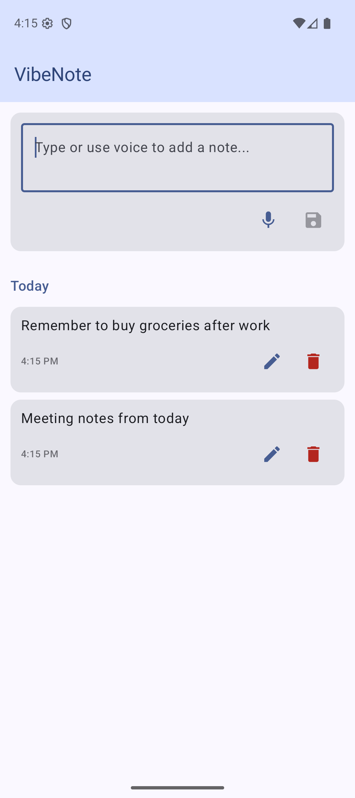

# VibeNote

A minimal Android app for creating daily notes using voice input or text.

## Features

- **Voice-to-text** — Tap the mic button to dictate notes using Android's built-in speech recognition
- **Note detail view** — Tap a note card to view it full-screen with date, time, and content
- **Local persistence** — Notes stored in a Room database, available offline
- **Daily grouping** — Notes organized by date (Today, Yesterday, or full date)
- **Edit & delete** — Edit or delete notes from the list or the detail screen

## Tech Stack

- Kotlin, Jetpack Compose, Material 3
- Room (local database)
- ViewModel + StateFlow
- RecognizerIntent (voice input)

## Build & Run

```bash
./gradlew installDebug       # Build and install on connected device/emulator
./gradlew connectedDebugAndroidTest  # Run UI tests
```

## Screenshots

<p float="left">
  
  
</p>
